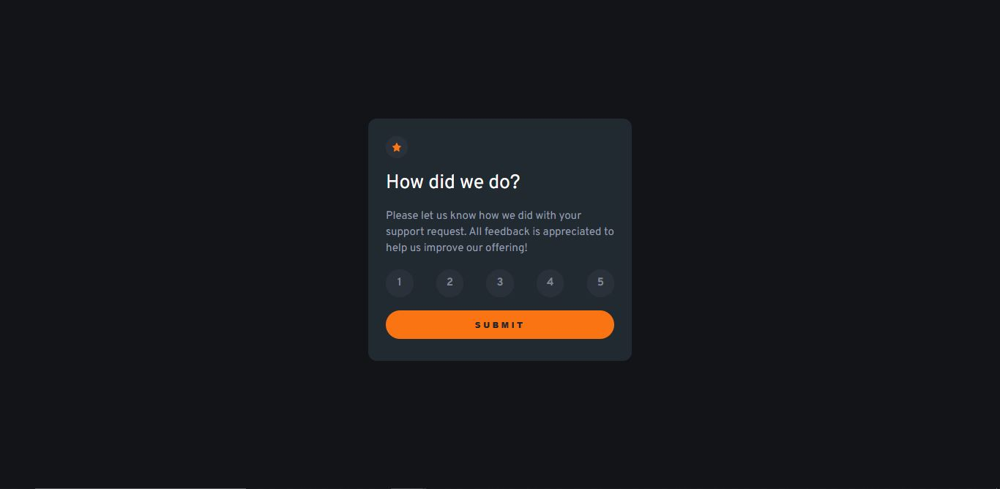

# Frontend Mentor - Interactive Rating Component Solution

This is a solution to the [Interactive rating component challenge on Frontend Mentor](https://www.frontendmentor.io/challenges/interactive-rating-component-koxpeBUmI). Frontend Mentor challenges help you improve your coding skills by building realistic projects.

---

## Table of Contents

* [Overview](#overview)

  * [The Challenge](#the-challenge)
  * [Screenshot](#screenshot)
  * [Links](#links)
* [My Process](#my-process)

  * [Built With](#built-with)
  * [What I Learned](#what-i-learned)
  * [Continued Development](#continued-development)
  * [Useful Resources](#useful-resources)
* [Author](#author)
* [Acknowledgments](#acknowledgments)

---

## Overview

### The Challenge

Users should be able to:

* Select a number rating from 1–5.
* Submit their rating.
* See a "Thank you" card state after submission.
* Interact with all elements using a keyboard.
* See hover and focus states for interactive elements.
* Experience responsive layouts on different devices.

---

### Screenshot



---

### Links

* **Solution URL:** [GitHub Repository](https://github.com/yourusername/interactive-rating-component)
* **Live Site URL:** [View Live Project](https://your-username.github.io/interactive-rating-component/)

---

## My Process

### Built With

* Semantic HTML5
* CSS Variables & Flexbox
* CSS Grid
* Mobile-first workflow
* Vanilla JavaScript for DOM manipulation
* `localStorage` to persist selected rating

---

### What I Learned

While building this project, I learned to:

* Manage state with JavaScript (`selectedRating`) and store it in `localStorage`.
* Use **event delegation** to handle multiple buttons efficiently.
* Implement **dynamic styling** for selected buttons (hover and active states).
* Navigate between pages while passing data (`window.location.href` + `localStorage`).

**Example JavaScript snippet for button selection:**

```js
inputGroup.addEventListener('click', e => {
  if(e.target.tagName !== 'INPUT') return;
  inputs.forEach(input => input.style.backgroundColor = '');
  e.target.style.backgroundColor = 'hsla(0, 0%, 100%, 1)';
  selectedRating = e.target.value;
});
```

**Example localStorage usage:**

```js
form.addEventListener('submit', e => {
  e.preventDefault();
  if(!selectedRating) return;
  localStorage.setItem('rate', selectedRating);
  window.location.href = "thank-you-card.html";
});
```

---

### Continued Development

* Explore using **CSS animations** for smooth hover/active effects.
* Implement more advanced state management using JavaScript modules.
* Add **form validation** and accessibility improvements.
* Experiment with React or other frameworks for component-based architecture.

---

### Useful Resources

* [MDN Web Docs – Event Delegation](https://developer.mozilla.org/en-US/docs/Learn/JavaScript/Building_blocks/Events#event_delegation)
* [Frontend Mentor – Interactive Rating Challenge](https://www.frontendmentor.io/challenges/interactive-rating-component-koxpeBUmI)
* [MDN Web Docs – localStorage](https://developer.mozilla.org/en-US/docs/Web/API/Window/localStorage)

---

## Author

* **Name:** Bright AG
* **Frontend Mentor:** [@brightWeb_3](https://www.frontendmentor.io/profile/brightWeb_3)
* **Twitter:** [@brightWeb_3](https://twitter.com/brightWeb_3)


## Acknowledgments

* Inspired by the **Interactive Rating Component** design on Frontend Mentor.
* Thanks to the **Frontend Mentor community** for support and best practices.

